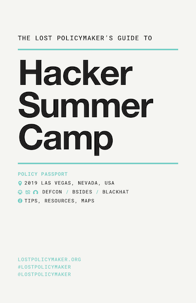

## About the Lost Policymaker Guide
The Lost Policymaker is a tongue-in-cheek nod to all the great travel guides that have given aid and comfort to those who seek new experiences in unknown spaces. We hope it will serve you in the same capacity as you travel through a hacker conference or three, whether that's in the heat of the Las Vegas desert, the friendly confines of Washington D.C., the wild west coast in San Francisco, or elsewhere.

In recent years public policymakers have increasingly frequented hacker and infosec conferences. This guide can serve as a reference and roadmap to help those in the policy field more quickly gain their footing at the events and understand hacker ethos and culture. The four conferences featured in this guide represent some of the top hacker and infosec conferences in the world.

### Shmoocon
`January 30 - February 2, 2020`

[Shmoocon](https://shmoocon.org) ([@Shmoocon](https://twitter.com/shmoocon)) is a small, low-key hacker conference in Washington D.C. with a near-cult following and a sense of humor. Its logo is a moose. [Learn more about Shmoocon...](shmoocon)

### Black Hat
`August 1-6, 2020`

The [Black Hat](https://blackhat.com) conference features talks about security issues and approaches that impact enterprises and corporations. [Learn more about Black Hat...](blackhat)

### BSides Las Vegas
`August 4-5, 2020`

[BSides Las Vegas](https://bsideslv.org) is the original in a series of over 100 global annual events, founded in 2009 as an 'un-conference' style event as as more laid-back alternative to DEF CON and Black Hat. [Learn more about BSides Las Vegas...](bsideslv)

### DEF CON XXVII
`August 6-9, 2020`

The [DEF CON](https://defcon.org) is the premiere global hacker conference. Even after nearly 30 years, DEF CON remains an open space for intellectual exploration, open to all those who want to participate in good faith. [Learn more about DEF CON...](defcon)

The original [Lost Policymaker's Guide to Hacker Summer Camp](guide) covers three events: [Black Hat](https://blackhat.com), [BSides Las Vegas](https://bsideslv.org), and [DEF CON](https://defcon.org).

## Follow and Contribute

Follow the action with [#lostpolicymaker](https://twitter.com/search?q=%23lostpolicymaker) and [#defconpolicy](https://twitter.com/search?q=%23defconpolicy) on your favorite social media outlets.

Contribute content on the [GitHub repository](https://github.com/lostpolicymaker/lostpolicymaker.github.io) by opening issues or making pull requests.
