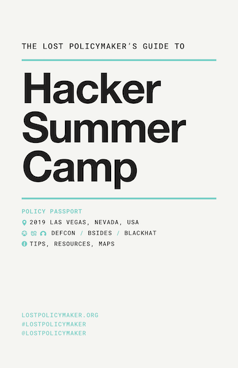

  

### About the Lost Policymaker Guide

  

The Lost Policymaker is a tongue-in-cheek nod to all the great travel guides that have given aid and comfort to those who seek new experiences in unknown spaces. We hope it will serve you in the same capacity as you travel through a hacker conference or three, whether that's in the heat of the Las Vegas desert, the friendly confines of Washington D.C., the wild west coast in San Francisco, or elsewhere.

In recent years public policymakers have increasingly frequented hacker and infosec conferences — so much so that DEF CON now runs a dedicated [Policy program](https://defcon.org/policy/). This guide can serve as a reference and roadmap to help those in the policy field more quickly gain their footing at the events and understand hacker ethos and culture. The conferences featured in this guide represent some of the top hacker and infosec conferences in the world.

### Hacker Summer Camp 2026

Every August, tens of thousands of hackers, security researchers, and — increasingly — policymakers descend on Las Vegas for a week of back-to-back conferences affectionately known as Hacker Summer Camp.

#### Black Hat USA
`August 1-6, 2026 - Mandalay Bay Convention Center`

The [Black Hat](https://blackhat.com/us-26/) conference features talks about security issues and approaches that impact enterprises and corporations. Trainings run August 1-4, with Briefings August 5-6. [Learn more about Black Hat...](blackhat)

#### BSides Las Vegas
`August 3-5, 2026 - Tuscany Suites and Casino`

[BSides Las Vegas](https://bsideslv.org) is the original in a series of hundreds of global annual events, founded in 2009 as an 'un-conference' style event and a more laid-back alternative to DEF CON and Black Hat. [Learn more about BSides Las Vegas...](bsideslv)

#### DEF CON 34
`August 6-9, 2026 - Las Vegas Convention Center`

[DEF CON](https://defcon.org) is the premiere global hacker conference. Even after more than 30 years, DEF CON remains an open space for intellectual exploration, open to all those who want to participate in good faith. [Learn more about DEF CON...](defcon)

#### ShmooCon (2005-2025)

After a 20-year run, [ShmooCon](https://shmoocon.org) — the small, low-key Washington D.C. hacker conference with a near-cult following and a moose for a logo — held its final event in January 2025. It is dearly missed. [Read our tribute to ShmooCon...](ShmooCon)

### Follow and Contribute

Follow Policy @ DEF CON on Mastodon at [@defconpolicy@defcon.social](https://defcon.social/@defconpolicy), and look for [#lostpolicymaker](https://defcon.social/tags/lostpolicymaker) and [#defconpolicy](https://defcon.social/tags/defconpolicy) on your favorite social media outlets.

Contribute content on the [GitHub repository](https://github.com/lostpolicymaker/lostpolicymaker.github.io) by opening issues or making pull requests.
